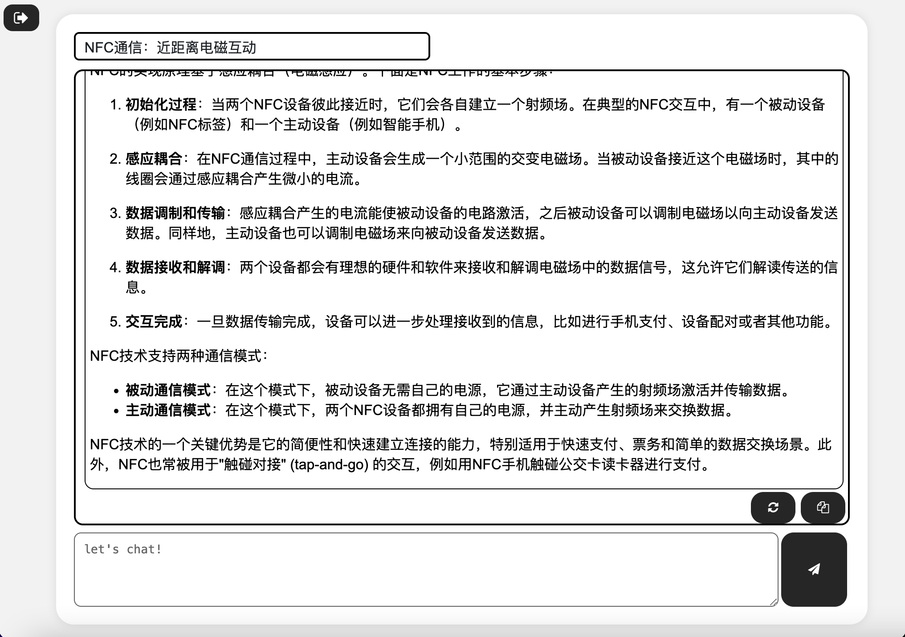

# GPT_Web
- 一个基于OpenAI api的本地网站
- **需要自备API密钥**
- 前往[https://platform.openai.com/account/api-keys](https://platform.openai.com/account/api-keys)获取你的API密钥
## 功能
- [x] 自选模型
- [x] 自定义逆天程度 
- [x] 单句回复/连续对话
- [x] 重新生成回复
- [x] 文字生成图片
- [x] 加载预设人格
- [x] 支持markdown渲染
- [x] 历史对话存储


## 快速开始
### NodeJS

1. 使用npm安装以下模块

```
npm install express querystring body-parser mysql2 js-yaml express-session
```

2. 将源代码下载至本地

```
git clone https://github.com/DINOREXNB/GPT_Web.git
```

3. 执行`GPT_Web_init.sql`创建`client`数据库用于存储历史对话

4. 进入工作区后，将`Settings_example.yaml`重命名为`Settings.yaml`，编辑配置文件

```
## 数据库配置信息(存储历史对话用)
mysql:
 host: 'localhost'
 port: 3306
 user: 'root'
 password: '114514'
 database: 'client'

## 服务器配置(必填)
server:
 host: "localhost"
 port: 1145
 location: "http://localhost:1145"
```

5. 启动服务器

```
node server.js
```