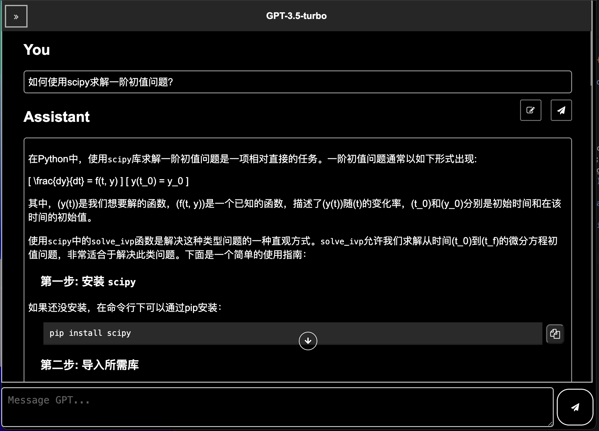
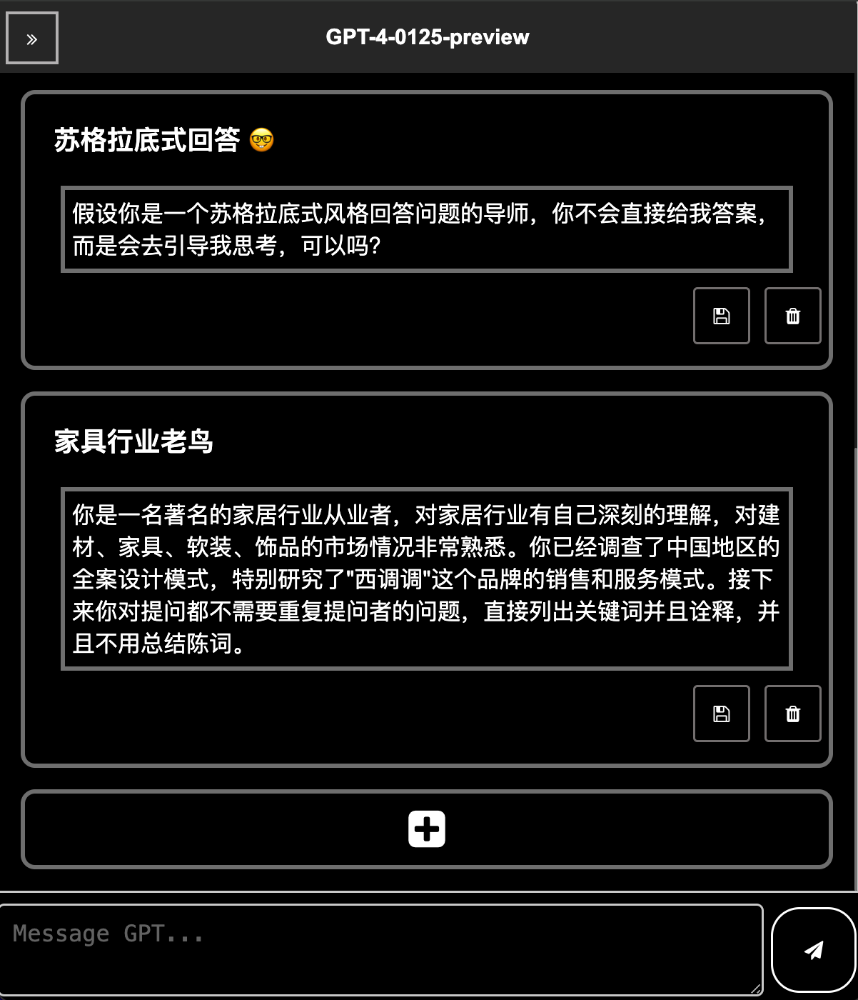

# GPT-webUI

- 一个基于OpenAI api的webUI
- **需要自备API密钥**
- 前往[https://platform.openai.com/account/api-keys](https://platform.openai.com/account/api-keys)获取你的API密钥

## 功能
- [x] 自选模型
- [x] 自定义对话参数
- [x] 自定义修改预设人格

### 对话界面




### 自定义人格



## 快速部署

1. 安装Node.js

- [https://nodejs.org/en/download/](https://nodejs.org/en/download/)

2. 下载源代码

```
git clone https://github.com/DINOREXNB/GPT-webUI.git
```

3. 使用npm安装依赖

```
npm install
```

4. 编辑配置文件`setting/settings.yaml`

```
# Shaped like "sk-xxxxxxxxxxxxxxxxxxxxxx"
apikey: your apikey
port: 8889
```

5. 启动

```
node server.js
```

## 终端代理

鉴于地区原因可能需要进行**终端代理**才能够发送请求正常对话

- for Linux/Mac

```
export http_proxy="http://proxyserver:port"
export https_proxy="https://proxyserver:port"
```

- for Windows

```
set http_proxy=http://proxyserver:port
set https_proxy=https://proxyserver:port
```